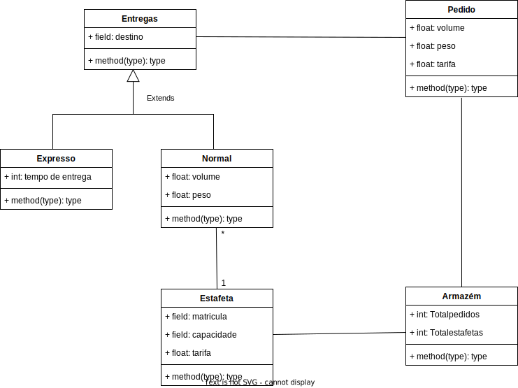

ARMAZEM -- contem todas as mercadorias  
ENTREGA -- pode ser normal ou expresso  
PEDIDOS -- tipo de transporte contratado aka tipo de entrega, peso e volume do pacote e preco da entrega

ENTREGA NORMAL -- nao é entregue no mesmo dia, sao as mais comuns. são contratados estafetas que usam os seus proprios carros por isso estas entregas nao precisam de pensar numa frota/organizaçao dos veiculos disponiveis 
 
ENTREGA EXPRESSO -- uma unica viatura que consegue transportar um pedido de cada vez independente do seu volume/peso, tem associado um tempo estimado de entrega (inclui entrega ao cliente + tempo de regresso ao armazem)

ESTAFETAS -- matricula, capacidade do veiculo = volume max e peso max que pode transportar, custo de transporte (o que o estafeta cobra), so fazem uma viagem por dia 'deve-se portanto maximizar o número de pedidos a transportar por um estafeta numa jornada', sempre disponiveis para fazer entregas

CENARIO 1 -- OTIMIZACAO DOS ESTAFETAS (so aplicavel a entregas normais)
'O objetivo principal é minimizar o número de estafetas para a entrega de todos os pedidos ou do maior número de pedidos, num dia.'
a otimizaçao é feita por dia, otimizar o numero de estafetas para as entregas daquele dia especifico 
dados a considerar: 
	1. estafetas registados com capacidade requerida (volume V e peso P) 
	2. nº pedidos com volume V e peso P 

CENARIO 2 -- OTIMIZACAO DO LUCRO  
'O objetivo principal é maximizar o lucro da empresa (diferença entre a receita total e o custo total) para a entrega de todos os pedidos ou do maior número de pedidos, num dia, pelos estafetas selecionados' 
procurar os estafetas que conseguem levar a encomenda pelo menor custo possivel 
dados a considerar: 
	1. estafetas registados com capacidade requerida (volume V e peso P) e custo C 
	2. nº pedidos com volume V, peso P e recompensa (preco cliente) R 

CENARIO 3 -- OTIMIZACAO ENTREGA EXPRESSO 
'O objetivo principal é minimizar o tempo médio previsto das entregas expresso a serem realizadas num dia.' 
as entregas so podem ser efetuadas entre as 9 e 17, no entanto a carrinha pode sair antes do armazem para maximizar tempo aproveitado  
dados a considerar: 
	1. conjunto de pedidos expresso, com volume V, peso P e tempo de entrega T. 

COMUM AOS 3 CENARIOS -- 'Os pedidos que não puderem ser transportados num dia, são descartados e retornam ao fornecedor.' 

'Ambos os datasets podem ser utilizados tanto para pedidos normais como para pedidos expresso,
considerando-se os campos apropriados. Os datasets poderão ser manipulados, estendidos e
editados da forma como os grupos julgarem mais adequada, de acordo com as soluções que
propõem implementar. Outros datasets poderão também ser considerados e utilizados pelos
grupos.'

  

  <b><i>Image 2. UML Class Diagram</i></b>

